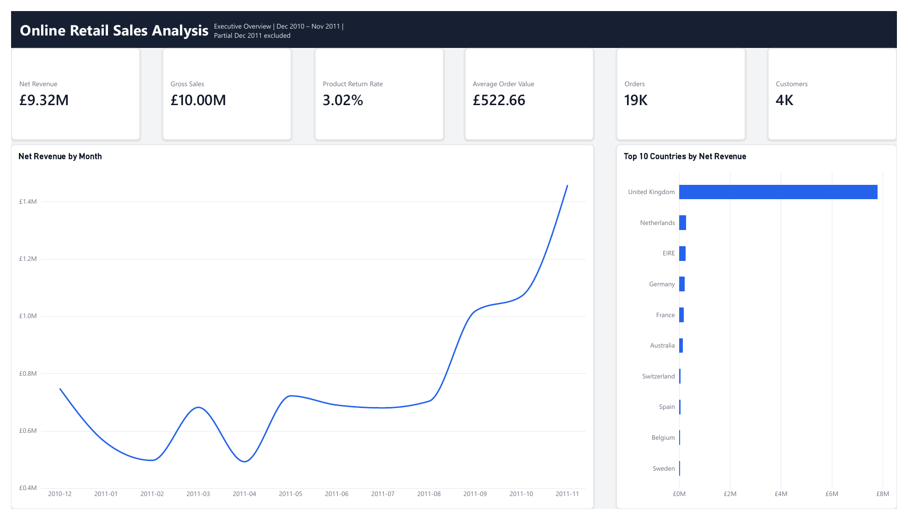
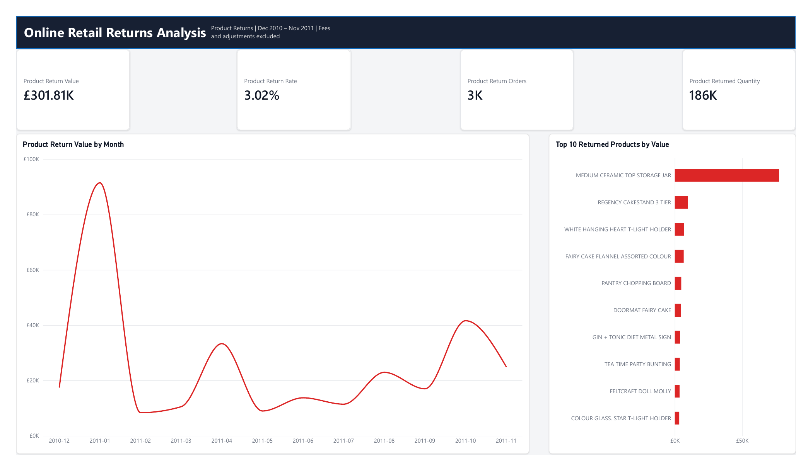

# Online Retail Sales & Returns | Power BI

A Power BI practice project built from the [UCI Online Retail dataset](https://archive.ics.uci.edu/dataset/352/online+retail). The report covers **December 2010 through November 2011**; the incomplete December 2011 period is excluded from both pages.

## Business questions

- How did net revenue change month by month, and which countries contributed most?
- How large were product-related negative transactions, and which products drove them?

## Dashboard

**Executive Overview** shows net revenue, gross sales, product return rate, average order value, order count and customer count, with monthly revenue and the top 10 countries.

**Returns Analysis** shows the value, rate, order count and quantity of product-related negative transactions, with a monthly trend and the top 10 product descriptions.

Open the [Power BI file](online_retail_analysis.pbix) to inspect the model, calculations, and interactive visuals.

## Key findings

1. **Net revenue was approximately £9.32 million**, against about **£10.00 million in gross sales** in the selected period. Net revenue reached its highest monthly level in **November 2011** at roughly **£1.45 million**.
2. **The United Kingdom accounted for most net revenue**; the next countries on the chart were much smaller. The report identifies a geographic concentration, although its exact share should be calculated before making a percentage claim.
3. **Product-related negative transactions totalled approximately £301.81 thousand**, equivalent to **3.02% of gross sales** under the report's classification. January 2011 had the largest monthly amount.
4. **MEDIUM CERAMIC TOP STORAGE JAR dominated the product ranking.** Further inspection traced much of that value to one unusually large cancelled order. This is an important anomaly to investigate separately; the dataset does not establish why it was cancelled.

**Practical next step:** review large cancelled orders individually and monitor the product-related negative amount over time. A small number of unusual transactions can distort a product ranking or a monthly trend.

## Data preparation and definitions

The source contains **541,909 transaction lines** from 1 December 2010 to 9 December 2011. In Power Query, the analysis uses a referenced `Transactions` query; the raw staging query is excluded from model load. The preparation includes data types, `UnitPrice > 0`, removal of exact duplicate rows, and calculated `LineRevenue = Quantity × UnitPrice`. Positive quantity is classified as `Sale`; negative quantity as `Return`. A calendar table is related to the transaction date.

- **Gross Sales:** value of positive transaction lines, before negative lines.
- **Net Revenue:** sum of all included transaction lines, positive and negative.
- **Average Order Value:** gross sales divided by distinct sale invoice numbers.
- **Customers:** distinct nonblank customer IDs on sale lines. Missing IDs are retained in revenue but excluded from this customer count.
- **Product Return Value:** absolute value of negative lines classified as product-related after excluding a specified list of fee and adjustment stock codes. **Product Return Rate:** that value divided by gross sales.

The `Return` and `Product Return` labels are analytical conventions. The source does not always distinguish a physical return from an order cancellation or explain its cause. The exclusion list is heuristic, and the report should not be used to infer a verified operational return rate. Amounts are sales values in pounds, not profit; product costs are unavailable.

## Reproduce

1. Download the **Online Retail** workbook from the UCI source linked above.
2. Open `online_retail_analysis.pbix` in Power BI Desktop.
3. If prompted, point the source step in Power Query to the downloaded workbook, then apply changes and refresh.

The source workbook is linked rather than redistributed in this repository.